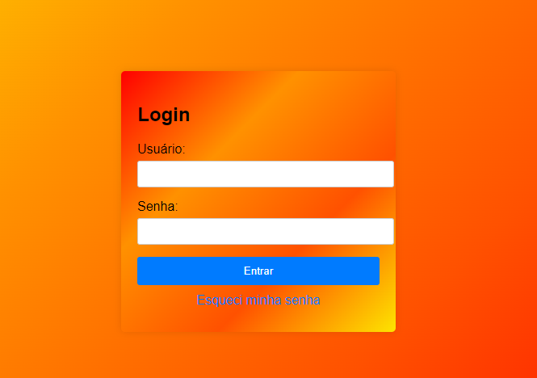

# indice
* [descricao](#descricao)
* [introduca](#introducao)
* [funcionalidades](#funcionalidades)
* [fontes_utilizadas](#fontes-utilizadas)
* [autores](#autores)

# descricao
* o site "form login v2" é uma atualizacao de um outro site de login [confira](https://github.com/cris24tayler/Form_Login) peguamos o site antigo e adcionamos o java script nele e melhoramos o css.

# introducao
* para usar basta colocar o email e senha e se caso tiver esquecido a senha clique em ESQUECI MINHA SENHA, depois de digitar o email e a senha clique em entrar.

# funcionalidades
* entrar em sua conta em um app ou site

# fontes utilizadas
* chat gpt
* bootstrap 5
* google
* projetos dos outros como inspiracao

# autores
* cristian
* feito com aconpanhamento do professor [leonardo](https://github.com/leonardorochamarista)